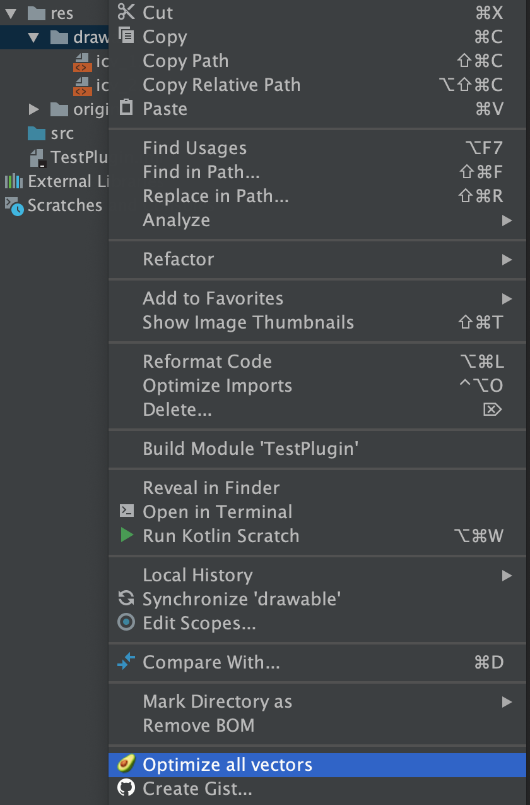
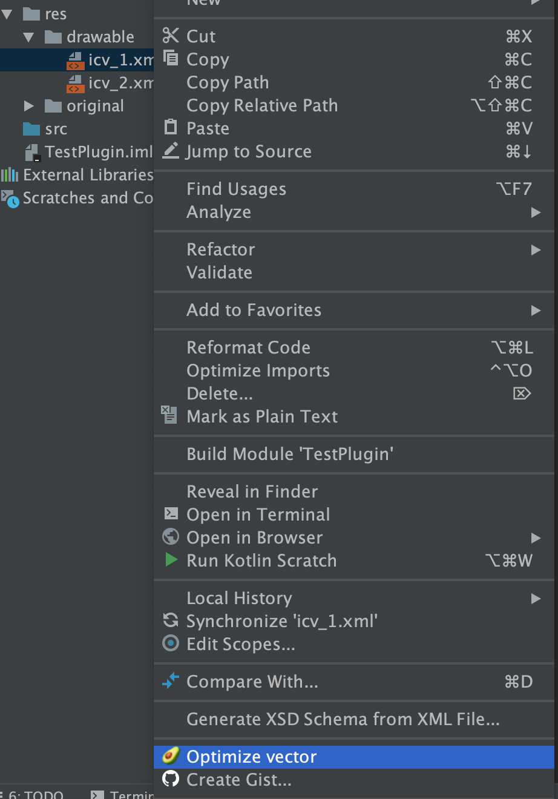

# avocado-plugin

 This plugin is based on [`avocado tool`][avocado tool] from [`Alex Lockwood`][Alex Lockwood].
      
`avocado` is a command line tool (similar to [`svgo`][svgo]) that optimizes Android
`VectorDrawable` (VD) and `AnimatedVectorDrawable` (AVD) xml files.

## Installation
Install [`avocado tool`][avocado tool] 

Then you can install the plugin from the [`Plugin Repository`][Plugin Repository].

## Usage
This plugin can be used in two different ways:

1. Tap on `drawable` folder to optimize all the vectors:

2. Tap on any vector from `drawable` folder to optimize:

[avocado tool]: https://github.com/alexjlockwood/avocado
[Alex Lockwood]: https://github.com/alexjlockwood
[svgo]: https://github.com/svg/svgo
[Plugin Repository]: https://plugins.jetbrains.com/plugin/12092-vector-drawable-optimization-tool
